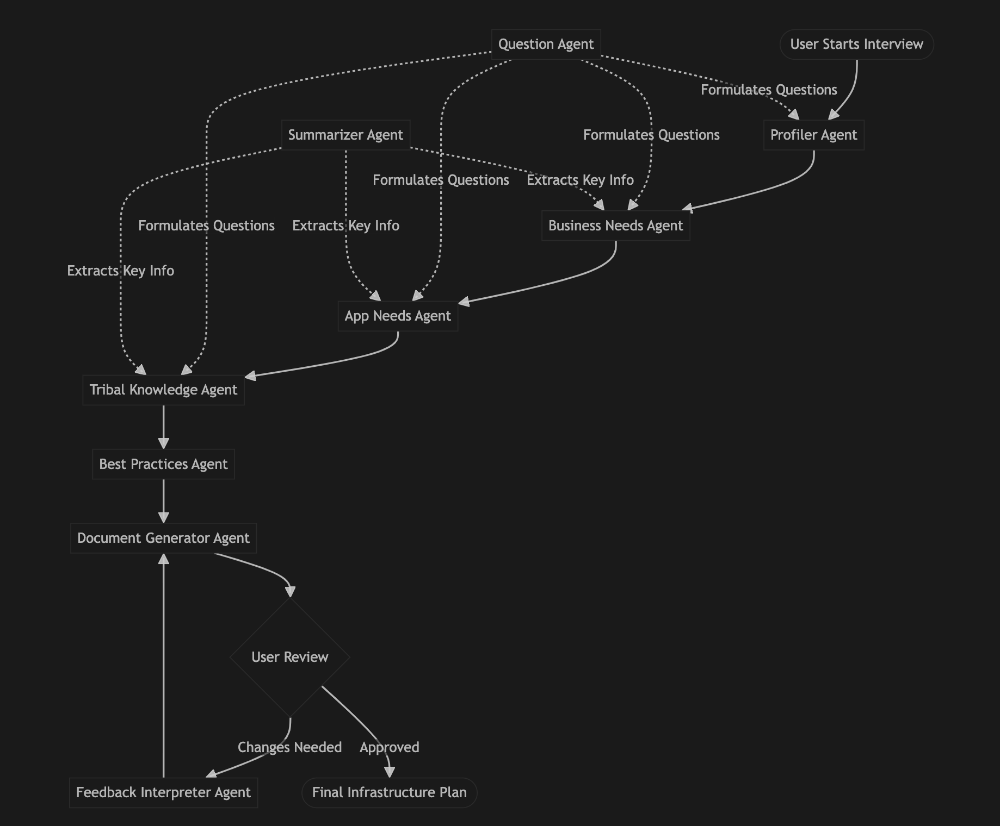

# Functional and Technical Specification - Shipyard MVP

## Project Overview

Shipyard is an AI-powered infrastructure planning assistant that interviews engineers about their infrastructure needs and automatically generates a comprehensive infrastructure planning document. The system adapts its questioning based on the user's expertise level and progressively builds a detailed infrastructure plan.

## Goals and Objectives

### Primary Goals
1. **Simplify Infrastructure Planning**: Guide users through infrastructure decisions without requiring deep technical knowledge
2. **Adaptive Interviewing**: Adjust question complexity based on user expertise
3. **Comprehensive Output**: Generate a detailed infrastructure plan document covering all aspects from architecture to security

### MVP Objectives
- Implement a working prototype using plain Python and OpenAI SDK
- Sequential interview flow through multiple specialized agents
- Generate a complete infrastructure plan markdown document
- Allow users to review and request changes to the final document

## Technical Architecture

### Technology Stack
- **Language**: Python 3.11
- **Primary LLM API**: OpenAI o3 and o3-mini via Reasoning API
- **Fast Operations Models**: GPT-4o for skip detection, follow-up detection, and expertise extraction
- **API Library**: OpenAI Python SDK v1.95.1 (from PyPI)
- **Agent Orchestration**: Plain Python with enhanced context sharing (no framework for MVP)
- **Future Consideration**: Migration to LangGraph for complex workflows

### High-Level Architecture

```
[User] <-> [Main Interview Loop] <-> [OpenAI SDK] <-> [Reasoning API (o3/o3-mini)]
               |                                            |
               v                                            v
        [Agent Controllers]                        [Chat Completions API (GPT-4o)]
               |                                            |
               v                                            v
        [Enhanced State Management] <-----------> [Fast Operations Engine]
               |
               v
        [Document Generation]
```

### API Usage Details
- **Primary API**: OpenAI Reasoning API (`/v1/chat/completions`) for o3 and o3-mini
- **Fast Operations API**: OpenAI Chat Completions API for GPT-4o fast operations
- **SDK Library**: `openai` v1.95.1 Python package for API interactions
- **Primary Models**: o3 and o3-mini for main agent responses and document generation
- **Fast Operations Model**: GPT-4o for skip detection, follow-up detection, and expertise extraction
- **Message Format**: Structured conversation history with role-based messages and enhanced context sharing

### Enhanced Context Management
- **Cross-Agent Memory**: All agents receive complete conversation history from previous agents
- **Duplicate Prevention**: Agents are explicitly instructed to avoid repeating topics already covered
- **Technology Stack Persistence**: Once user mentions specific technologies, all subsequent agents build upon this information
- **Message Role Separation**: Clear separation between system instructions and user conversations

## Agent Definitions and Responsibilities

The flow between agents is illustrated in the diagram below, showing how the Question Agent and Summarizer Agent support the core interview agents throughout the process.

### Core Interview Agents

1. **Profiler Agent**
   - **Purpose**: Assess user's technical expertise and project context
   - **Output**: User expertise level (novice/intermediate/advanced), project type, company context
   - **Topics**: Experience level, project overview, personal vs company use

2. **Business Needs Agent**
   - **Purpose**: Gather business requirements and constraints
   - **Output**: Scale requirements, uptime needs, budget, compliance requirements
   - **Topics**: User scale, availability requirements, performance expectations, budget constraints

3. **App Needs Agent**
   - **Purpose**: Collect technical application requirements
   - **Output**: Tech stack, deployment preferences, data needs
   - **Topics**: Application type, programming languages, databases, external integrations

4. **Tribal Knowledge Agent**
   - **Purpose**: Understand organizational constraints and preferences
   - **Output**: Required tools, existing infrastructure, team preferences
   - **Topics**: Cloud provider preferences, existing tools, security requirements

5. **Best Practices Agent**
   - **Purpose**: Fill gaps with industry best practices
   - **Output**: Default configurations for unspecified requirements
   - **Topics**: Network policies, monitoring, security defaults, disaster recovery

### Support Agents

6. **Question Agent** (Integrated into each pillar's flow)
   - **Purpose**: Each pillar agent formulates its own questions based on expertise
   - **Adapts**: Questions complexity based on stated and observed expertise
   - **Follow-ups**: Can ask up to 3 follow-up questions per topic for clarity

7. **Summarizer Agent**
   - **Purpose**: Extract key information after each pillar completes
   - **Input**: Chat history from a pillar
   - **Output**: Structured summary of requirements gathered

8. **Document Generator Agent**
   - **Purpose**: Create the final infrastructure planning document
   - **Input**: All collected requirements and summaries
   - **Output**: Comprehensive markdown document

9. **Feedback Interpreter Agent**
   - **Purpose**: Understand and apply user revision requests
   - **Input**: User feedback on document
   - **Output**: Specific changes to apply

## Data Flow and State Management

### State Structure
```python
state = {
    "chat_history": {},  # Current conversation within each agent/pillar
    "state": {  # Shipyard app state - context from all agents
        "user_profile": {
            "expertise_level": None,  # "novice", "intermediate", "advanced" - user selected
            "project_description": None,  # General description of what they're building
            "gauged_complexity": None,  # Our assessment based on how they describe things
        },
        "current_document": {},  # Incrementally built document sections
        "all_conversations": [],  # Log of all Q&A pairs across agents (for debugging)
        "follow_up_counts": {}  # Track follow-ups per topic: {"business.scaling": 2}
    },
    "summaries": {  # Key info extracted after each pillar completes (dynamic)
        "profiler": {
            # Example after completion:
            # "expertise_stated": "intermediate",
            # "expertise_observed": "advanced", 
            # "project_type": "saas",
            # "domain": "fintech",
            # "timeline": "3 months"
        },
        "business": {
            # Example after completion:
            # "user_scale": "10k monthly",
            # "uptime_requirement": "99.9%",
            # "budget": "limited but flexible",
            # "compliance": ["PCI DSS"]
        },
        "app": {},
        "tribal": {}
    }
}
```

### Data Flow: Chat History vs State vs Summaries

**Your Terminology (Now Implemented):**

1. **Chat History** - Messages object sent to LLM each iteration:
   ```python
   # Natural conversation flow within a single agent/pillar
   messages = [
       {"role": "system", "content": "You are a business expert. [STATE CONTEXT INJECTED]\n\nPREVIOUS CONVERSATIONS (DO NOT REPEAT THESE TOPICS):\n[CONTEXT FROM OTHER AGENTS]"},
       {"role": "user", "content": "Hi! I'm ready to answer your questions"},  # Natural conversation starter
       {"role": "assistant", "content": "What kind of traffic patterns do you expect?"},
       {"role": "user", "content": "About 10k users monthly"},
       # Continues naturally within same agent...
   ]
   ```

2. **State** - Shipyard app state with cross-agent context:
   ```python
   # Everything agents need to know from other agents
   state = {
       "user_profile": {"expertise_level": "intermediate"},
       "current_document": {"architecture": "...", "security": "..."},
       "all_conversations": [...],  # Complete conversation archive for DocumentGenerator
       "previous_pillars_completed": ["profiler", "business"]  # Track completion
   }
   ```

3. **Summaries** - Extracted key info after pillar completes:
   ```python
   # What AI planner needs to know (not in document)
   summaries = {
       "profiler": {"expertise": "intermediate", "project_type": "startup"},
       "business": {"scale": "10k users", "budget": "limited"}
   }
   ```

**Enhanced Flow with Reasoning Models:**
- Each agent maintains its own **chat history** naturally
- **State** gets injected into system prompts with previous agent context
- **Summaries** extracted after each pillar for planning
- **Primary Operations** use o3 and o3-mini reasoning for main agent conversations and document generation
- **Fast Operations** use GPT-4o for skip detection, follow-up detection, and expertise extraction
- **Cross-Agent Context** prevents duplicate questions and builds upon mentioned technologies

### Example: How All Three Work Together

```python
# 1. CHAT HISTORY (within Business Agent)
state["chat_history"]["business"] = [
    {"role": "assistant", "content": "How many users do you expect?"},
    {"role": "user", "content": "About 10k monthly"},
    {"role": "assistant", "content": "What uptime do you need?"},
    {"role": "user", "content": "99.9% would be great"}
]

# 2. STATE (cross-agent context)
state["state"] = {
    "user_profile": {
        "expertise_level": "intermediate",
        "project_type": "startup"
    },
    "current_document": {
        "architecture": "Microservices on AWS...",
        "security": "OAuth2 with JWT tokens..."
    }
}

# 3. SUMMARIES (extracted after profiler completed)
state["summaries"] = {
    "profiler": {
        "expertise": "intermediate",
        "project_type": "startup", 
        "timeline": "3 months"
    }
}

# When Business Agent continues conversation:
system_prompt = """
You are a business requirements expert.

CURRENT STATE CONTEXT:
- User expertise: intermediate
- Project type: startup

SUMMARIES FROM COMPLETED PILLARS:
{
    "profiler": {
        "expertise": "intermediate",
        "project_type": "startup",
        "timeline": "3 months"
    }
}

CURRENT DOCUMENT BEING BUILT:
{
    "architecture": "Microservices on AWS...",
    "security": "OAuth2 with JWT tokens..."
}
"""

# OpenAI API gets natural conversation flow:
messages = [
    {"role": "system", "content": system_prompt},
    {"role": "assistant", "content": "How many users do you expect?"},
    {"role": "user", "content": "About 10k monthly"},
    {"role": "assistant", "content": "What uptime do you need?"},
    {"role": "user", "content": "What do you mean 'all the time'?"},  # User needs clarification
    {"role": "assistant", "content": "Good question! Uptime refers to..."},  # Follow-up explanation
    {"role": "user", "content": "Oh, then 99.9% would be great. Now ask me about budget"}  # Current input
]
```

### Flow Diagram

flowchart TD
  boot([Start]) --> profiler[User Profiler]
  profiler -->|writes user_profile| pickSection{Pick next<br>todo section}
  pickSection -->|Business| bizAgent
  pickSection -->|App| appAgent
  pickSection -->|Tribal| tribalAgent
  pickSection -->|Best Prac| bestAgent
  bizAgent --> reflectB
  appAgent --> reflectA
  tribalAgent --> reflectT
  bestAgent --> reflectP
  reflectB --> updateDoc
  reflectA --> updateDoc
  reflectT --> updateDoc
  reflectP --> updateDoc
  updateDoc --> askUser{Need confirmation?}
  askUser -->|Yes| waitUser[User edit / answer]
  askUser -->|No| pickSection
  waitUser --> pickSection
  pickSection -->|no sections left| compile[Compile final InfraDoc]
  compile --> finish([✅ Done])


## User Experience Flow

### Interview Process
1. **Welcome & Context Setting**
   ```
   "I'll help you create a comprehensive infrastructure plan. I'll ask about various aspects 
   of your project. Don't worry if you're not sure about something - just tell me what you 
   know, and I'll help fill in the gaps with best practices. You can skip any question 
   by saying 'skip' or 'I don't know'."
   ```

2. **Adaptive Questioning**
   - Start with general questions for all users
   - Dig deeper based on demonstrated expertise
   - Always provide skip option
   - Show empathy for non-technical users

3. **Progressive Document Building**
   - Show document sections as they're completed
   - User sees progress throughout the interview
   - Final review and editing phase

4. **Review Loop**
   - Present complete document
   - Accept natural language feedback
   - Apply changes and regenerate sections
   - Repeat until user approves

## Implementation Details

### Main Flow Structure
```python
async def run_interview():
    state = initialize_state()
    
    # Run each pillar in sequence with enhanced context sharing
    state = await run_pillar("profiler", PROFILER_TOPICS, state)
    state = await run_pillar("business", BUSINESS_TOPICS, state)
    state = await run_pillar("app", APP_TOPICS, state)
    state = await run_pillar("tribal", TRIBAL_TOPICS, state)
    
    # Apply best practices to fill gaps
    state = await apply_best_practices(state)
    
    # Generate complete document with full conversation context
    doc = await generate_document(state)
    
    # Review and revision loop
    final_doc = await review_loop(doc, state)
    
    return final_doc

async def run_pillar(pillar_name, topics, state):
    # Initialize chat history for this pillar if not exists
    if pillar_name not in state["chat_history"]:
        state["chat_history"][pillar_name] = []
    
    agent_prompt = AGENT_PROMPTS[pillar_name]
    
    for topic in topics:
        follow_up_count = 0
        max_follow_ups = 3
        topic_complete = False
        
        while not topic_complete and follow_up_count < max_follow_ups:
            # Build system prompt with enhanced context from all previous agents
            system_prompt = build_system_prompt_context(agent_prompt, state, pillar_name)
            
            # Natural conversation flow - no fake user instructions
            if not state["chat_history"][pillar_name]:
                # First interaction with this agent
                user_input = "Hi! I'm ready to answer your questions"
            else:
                # Get actual user input
                user_input = await get_user_input()
            
            # Get agent's questions/response
            agent_response = await call_openai_agent(
                system_prompt, 
                user_input,
                state["chat_history"][pillar_name]
            )
            
            # Update chat history with proper role separation
            state["chat_history"][pillar_name].extend([
                {"role": "assistant", "content": agent_response},
                {"role": "user", "content": user_input}
            ])
            
            # Check if we need follow-up using GPT-4o fast operations
            if await needs_follow_up_fast_operation(user_input, agent_response):
                follow_up_count += 1
                state["state"]["follow_up_counts"][f"{pillar_name}.{topic}"] = follow_up_count
            else:
                topic_complete = True
            
            # Log complete conversation for DocumentGenerator
            state["state"]["all_conversations"].extend([
                {"agent": pillar_name, "role": "assistant", "content": agent_response},
                {"agent": pillar_name, "role": "user", "content": user_input}
            ])
    
    # Extract summary after pillar completes using AI summarization
    state["summaries"][pillar_name] = await summarize_pillar_llm(
        pillar_name, 
        state["chat_history"][pillar_name]
    )
    
    # Track completed pillars for context sharing
    state["state"]["previous_pillars_completed"].append(pillar_name)
    
    return state

async def needs_follow_up_fast_operation(user_answer, agent_question):
    """
    Use GPT-4o fast operations model to determine if user's answer indicates need for clarification
    Enhanced with reasoning capabilities for better understanding
    """
    prompt = f"""
    Analyze if this user response indicates confusion, uncertainty, or need for clarification:
    
    Agent Question: {agent_question}
    User Response: {user_answer}
    
    Consider:
    - Does the user ask for clarification or explanation?
    - Is the response vague, uncertain, or incomplete?
    - Does the user show confusion about technical concepts?
    - Would a follow-up question help gather more specific information?
    
    Respond with only "YES" if follow-up is needed, "NO" if the answer is clear and complete.
    """
    
    response = await client.chat.completions.create(
        model="gpt-4o",
        messages=[{"role": "user", "content": prompt}],
        temperature=0.1,
        max_tokens=10
    )
    
    return response.choices[0].message.content.strip().upper() == "YES"

def build_system_prompt_context(agent_base_prompt, state, pillar_name):
    """
    Build system prompt with enhanced context sharing from all previous agents
    Prevents duplicate questions and builds upon mentioned technologies
    """
    # Get conversations from all completed pillars
    previous_conversations = []
    for completed_pillar in state["state"]["previous_pillars_completed"]:
        if completed_pillar in state["chat_history"]:
            pillar_convo = state["chat_history"][completed_pillar]
            previous_conversations.extend([
                f"{completed_pillar.upper()}: {msg['content']}" 
                for msg in pillar_convo
            ])
    
    context = {
        "expertise_level": state["state"]["user_profile"].get("expertise_level", "unknown"),
        "gauged_complexity": state["state"]["user_profile"].get("gauged_complexity", "unknown"),
        "project_description": state["state"]["user_profile"].get("project_description", "No description yet"),
        "all_summaries": json.dumps(state["summaries"], indent=2),
        "current_document": json.dumps(state["state"]["current_document"], indent=2),
        "previous_conversations": "\n".join(previous_conversations)
    }
    
    # Enhanced prompt with context injection
    enhanced_prompt = f"""
{agent_base_prompt}

PREVIOUS CONVERSATIONS (DO NOT REPEAT THESE TOPICS):
{context['previous_conversations']}

CURRENT STATE CONTEXT:
- User expertise: {context['expertise_level']}
- Gauged complexity: {context['gauged_complexity']}
- Project: {context['project_description']}

SUMMARIES FROM COMPLETED PILLARS:
{context['all_summaries']}

IMPORTANT: 
- Do NOT ask about topics already covered in previous conversations
- BUILD UPON any technologies, platforms, or preferences already mentioned
- If user mentioned specific tech stack (e.g., Railway, GCP, React), acknowledge and use this context
- Adapt question complexity to user's demonstrated expertise level
"""
    
    return enhanced_prompt

async def summarize_pillar_llm(pillar_name, chat_history):
    """
    Use o3-mini reasoning model to create comprehensive summaries
    No rule-based extraction - pure AI understanding
    """
    conversation = "\n".join([
        f"{msg['role']}: {msg['content']}" 
        for msg in chat_history
    ])
    
    prompt = f"""
    Create a comprehensive summary of this {pillar_name} pillar conversation.
    Extract all specific details, numbers, requirements, and preferences mentioned.
    
    Conversation:
    {conversation}
    
    Return a structured JSON summary capturing all relevant information.
    """
    
    response = await client.beta.chat.completions.parse(
        model="o3-mini",
        messages=[{"role": "user", "content": prompt}],
        reasoning_effort="medium",
        temperature=0.2,
        max_tokens=1000
    )
    
    return response.choices[0].message.content
```

### OpenAI SDK Integration

```python
import json
import openai
from openai import OpenAI

# Initialize OpenAI client
client = OpenAI(
    api_key=os.environ.get("OPENAI_API_KEY")
)

async def call_openai_agent(system_prompt, user_message, chat_history=None):
    """
    Call OpenAI Reasoning API with o3/o3-mini for main agent conversations
    Enhanced with context sharing to prevent duplicate questions
    
    Args:
        system_prompt: Agent's system prompt (includes enhanced context from all agents)
        user_message: Current user input  
        chat_history: Chat history for THIS agent/pillar only
    """
    # Build messages object - always start with enhanced system prompt
    messages = [{"role": "system", "content": system_prompt}]
    
    # Add chat history if this agent has previous conversations
    if chat_history:
        messages.extend(chat_history)
    
    # Add current user message
    messages.append({"role": "user", "content": user_message})
    
    response = client.beta.chat.completions.parse(
        model="o3-mini",  # Use o3-mini for primary agent conversations
        messages=messages,
        reasoning_effort="medium",
        temperature=0.7,
        max_tokens=1000
    )
    
    return response.choices[0].message.content

async def call_fast_operation(prompt, operation_type="follow_up_detection"):
    """
    Call OpenAI Chat Completions API for fast operations using GPT-4o
    
    Args:
        prompt: The operation prompt
        operation_type: Type of operation for logging/debugging
    """
    response = await client.chat.completions.create(
        model="gpt-4o",
        messages=[{"role": "user", "content": prompt}],
        temperature=0.1,
        max_tokens=50
    )
    
    return response.choices[0].message.content
```

### Topic Lists

```python
PROFILER_TOPICS = [
    "expertise_assessment",
    "project_overview",
    "project_scale",
    "timeline"
]

BUSINESS_TOPICS = [
    "user_base",
    "traffic_patterns",
    "availability_requirements",
    "performance_sla",
    "budget_constraints",
    "compliance_requirements",
    "geographic_distribution"
]

APP_TOPICS = [
    "application_type",
    "programming_languages",
    "frameworks",
    "database_requirements",
    "storage_needs",
    "external_integrations",
    "api_requirements",
    "deployment_model"
]

TRIBAL_TOPICS = [
    "cloud_provider",
    "existing_tools",
    "team_expertise",
    "security_policies",
    "operational_preferences",
    "development_workflow"
]

INFRASTRUCTURE_CHECKLIST = [
    # Compute
    "compute_resources",
    "auto_scaling",
    "load_balancing",
    
    # Networking
    "network_architecture",
    "security_groups",
    "vpn_requirements",
    "cdn_needs",
    
    # Storage
    "database_setup",
    "object_storage",
    "backup_strategy",
    
    # Security
    "authentication",
    "authorization",
    "encryption",
    "secrets_management",
    
    # Monitoring
    "logging_strategy",
    "metrics_collection",
    "alerting_rules",
    
    # Disaster Recovery
    "backup_frequency",
    "recovery_objectives",
    "multi_region_strategy",
    
    # CI/CD
    "deployment_pipeline",
    "testing_strategy",
    "rollback_procedures"
]
```

## System Prompts

### Profiler Agent Prompt
```python
PROFILER_AGENT_PROMPT = """
You are a friendly infrastructure planning assistant starting an interview. Your goal is to understand:
1. The user's technical expertise level (they'll select novice/intermediate/advanced)
2. What they're building (project description)
3. The domain/industry
4. Basic scale and timeline

Be warm and encouraging. Make it clear that no technical knowledge is required.

Start with:
"Hi! I'm here to help you create a comprehensive infrastructure plan. First, let me learn a bit about you and your project.

Could you tell me:
1. What's your experience level with cloud infrastructure? (Novice/Intermediate/Advanced)
2. Can you describe what you're building? (Just a general overview is fine)
3. What industry or domain is this for? (e.g., e-commerce, fintech, healthcare, gaming, etc.)
4. When do you hope to launch?"

IMPORTANT: Assess their actual expertise from HOW they describe their project, not just their self-assessment. 
- If they use technical terms correctly: gauged_complexity = "higher than stated"
- If they struggle with basic concepts: gauged_complexity = "lower than stated"
- Store both their stated level and your assessment
"""

### Business Agent Prompt
```python
BUSINESS_AGENT_PROMPT = """
You are a business requirements expert for infrastructure planning. 

CRITICAL CONTEXT AWARENESS:
- Review PREVIOUS CONVERSATIONS carefully to avoid repeating topics
- BUILD UPON any technologies, platforms, or providers already mentioned (e.g., Railway, GCP, AWS)
- If user mentioned specific tech stack, acknowledge and use this as context for your questions
- DO NOT ask about cloud providers if user already mentioned one
- DO NOT repeat questions about scaling, users, or performance if already covered

Based on the user's expertise level and how they describe things, adapt your questions:

FOR NOVICE USERS:
- Start general: "How important is it that your app is always available?"
- Explain concepts: "Uptime means how often your app is working vs down for maintenance"
- Suggest options: "For a personal project, 95% uptime is usually fine. For business, 99.9% is standard"

FOR INTERMEDIATE USERS:
- Be more specific: "What uptime SLA do you need?"
- Probe deeper: "Any specific compliance requirements?"
- Assume basic knowledge but verify understanding

FOR ADVANCED USERS:
- Get technical quickly: "What's your RTO/RPO requirements?"
- Discuss tradeoffs: "Given your 99.99% uptime need, we'll need multi-region active-active"
- Assume expertise but still clarify ambiguities

TECHNOLOGY CONTEXT PERSISTENCE:
- If user mentioned Railway, ask about scaling within Railway context
- If user mentioned GCP, focus on GCP-specific business considerations
- If user mentioned specific frameworks/languages, tailor performance questions accordingly

ADAPTIVE QUESTIONING RULES:
1. Always provide skip option: "(Feel free to skip if this doesn't apply)"
2. If user shows confusion, provide gentle explanation
3. Start broad, then narrow based on response
4. Maximum 3 follow-ups per topic
5. Gauge understanding from HOW they answer, not just WHAT

Examples:
- User says "I need good uptime" → Follow up to quantify
- User says "99.9% with 5 minute RTO" → They know their stuff, dive deep
- User says "What's uptime?" → Explain gently with examples
"""

BEST_PRACTICES_PROMPT = """
You are an infrastructure best practices expert. Review the collected requirements and identify any gaps that need to be filled with sensible defaults.

For any missing requirements, add industry best practices with clear notation: "[AI Recommendation: ...]"

Consider ALL aspects from this checklist:
{infrastructure_checklist}

Current requirements:
{requirements}

Fill in missing pieces with practical, cost-effective defaults appropriate for their project scale and expertise level.
"""

DOCUMENT_GENERATOR_PROMPT = """
You are creating a comprehensive infrastructure planning document. Use the collected requirements to generate a detailed markdown document with these sections:

1. Executive Summary
2. Architecture Overview
3. Compute Resources
4. Networking Configuration
5. Storage Solutions
6. Security Measures
7. Monitoring and Observability
8. Disaster Recovery Plan
9. CI/CD Pipeline
10. Cost Estimates
11. Implementation Timeline
12. Assumptions and Recommendations

For each section:
- Use clear headings and subheadings
- Include specific configurations and services
- Note which decisions came from the user vs AI recommendations
- Add helpful diagrams where appropriate (using mermaid syntax)

Requirements:
{all_requirements}

Generate a professional, actionable infrastructure plan.
"""
```

## Document Structure

### Infrastructure Plan Sections
1. **Executive Summary** - High-level overview of the infrastructure design
2. **Architecture Overview** - System architecture with diagrams
3. **Compute Resources** - Servers, containers, serverless functions
4. **Networking Configuration** - VPC, subnets, load balancers, CDN
5. **Storage Solutions** - Databases, object storage, file systems
6. **Security Measures** - IAM, encryption, compliance, secrets management
7. **Monitoring and Observability** - Logging, metrics, alerts, dashboards
8. **Disaster Recovery Plan** - Backups, failover, RTO/RPO
9. **CI/CD Pipeline** - Build, test, deploy processes
10. **Cost Estimates** - Monthly/annual cost projections
11. **Implementation Timeline** - Phased rollout plan
12. **Assumptions and Recommendations** - AI-filled gaps and suggestions

## MVP Scope

### Included in MVP
- Sequential interview flow
- Adaptive questioning based on expertise
- All five core agents (Profiler, Business, App, Tribal, Best Practices)
- Support agents (Question, Summarizer, Document Generator, Feedback Interpreter)
- Incremental document building
- Single review/revision loop
- Plain Python implementation (no agent orchestration framework)
- OpenAI GPT-4o integration via Chat Completions API
- OpenAI Python SDK for API interactions

### Excluded from MVP (Future Enhancements)
- Web search capabilities
- Checkpointing/resume functionality
- Complex routing between agents
- Reflection loops within pillars
- Multiple LLM support
- Terraform/IaC generation
- Real-time collaboration
- Version control for documents

## Error Handling and Edge Cases

### User Abandonment
- Save state periodically (future enhancement)
- For MVP: Warn users that closing will lose progress

### Unclear Answers
- Question Agent should detect ambiguity using GPT-4o fast operations
- Follow up with clarifying questions
- Mark assumptions clearly in document

### Technical Errors
- OpenAI API failures: Implement exponential backoff
- Rate limiting: Add delays between API calls
- Malformed responses: Basic retry logic
- Reasoning API failures (o3/o3-mini): Fallback to GPT-4o for primary operations
- Fast operations failures: Basic retry logic for GPT-4o

### Message Role Separation Issues
- **Fixed**: Agents no longer receive instructions as user messages
- **Implementation**: Clear separation between system prompts and user conversations
- **Natural Flow**: Agents start conversations naturally without fake user instructions

### Context Sharing Problems
- **Enhanced**: All agents receive complete conversation history from previous agents
- **Duplicate Prevention**: Explicit instructions to avoid repeating covered topics  
- **Technology Persistence**: Mentioned technologies flow to all subsequent agents
- **Memory Management**: Track completed pillars and conversation state

## Success Metrics

### MVP Success Criteria
1. Complete interview in < 15 minutes
2. Generate comprehensive 10+ page infrastructure document
3. Cover all infrastructure checklist items
4. Successful adaptation to different expertise levels
5. User can review and request changes

### Quality Metrics
- Document completeness (all sections filled)
- Assumption ratio (user-provided vs AI-filled)
- User satisfaction with final document
- Time to completion

## Development Timeline

### Phase 1: Core Implementation (Week 1)
- Basic state management
- Question Agent with adaptive prompting
- Profiler and Business agents
- Simple console interface

### Phase 2: Agent Development (Week 2)
- App, Tribal, and Best Practices agents
- Summarizer Agent
- Incremental document building

### Phase 3: Document Generation (Week 3)
- Document Generator Agent
- Feedback Interpreter Agent
- Review loop implementation
- Polish and testing

## Future Roadmap

1. **LangGraph Migration** - For complex workflows and better state management
2. **Web Search Integration** - For latest best practices and pricing
3. **IaC Generation** - Terraform/CloudFormation output
4. **Collaboration Features** - Multiple stakeholders input
5. **Template Library** - Pre-built patterns for common architectures
6. **Cost Optimization** - Real-time cost analysis and recommendations
7. **Compliance Modules** - HIPAA, SOC2, GDPR specific guidance

## Appendix A: Example User Journey

### Novice User - Personal Blog
```
Profiler: "What's your experience with cloud infrastructure?"
User: "I've only used shared hosting before"
[System notes: expertise_level = novice]

Business: "How many visitors do you expect for your blog?"
User: "Maybe 1000 per month?"
[System adapts to simple questions]

App: "What platform will your blog use? WordPress, custom code, or something else?"
User: "WordPress"
[System fills in typical WordPress infrastructure needs]

Final document includes beginner-friendly explanations and managed service recommendations.
```

### Advanced User - SaaS Platform
```
Profiler: "What's your experience with cloud infrastructure?"
User: "I've architected several microservices platforms on AWS"
[System notes: expertise_level = advanced, gauged_complexity = advanced]

Business: "What are your specific SLA requirements?"
User: "99.95% uptime, <100ms p95 latency, SOC2 compliance needed"
[System asks detailed technical questions]

App: "What's your microservices communication pattern? REST, gRPC, event-driven?"
User: "Event-driven with Kafka, some synchronous gRPC for critical paths"
[System dives deep into technical specifications]

Final document includes detailed technical specifications and advanced patterns.
```

### Example: Follow-up Questions in Action
```
Business Agent: "How many users do you expect for your application?"
User: "About 10k monthly"

Business Agent: "What uptime requirements do you have for these users?"
User: "What do you mean 'all the time'?"
[System detects confusion, triggers follow-up]

Business Agent: "Good question! Uptime refers to the percentage of time your application 
is available and working properly. For example:
- 99% uptime = ~7 hours downtime per month
- 99.9% uptime = ~45 minutes downtime per month
- 99.99% uptime = ~4 minutes downtime per month

For a personal project, 95-99% is usually fine. But for 10k users with business 
purposes, 99.9% is typically recommended. What would work best for your use case?"

User: "Oh, I see. This is for my startup's main product, so 99.9% sounds right"
[Topic complete, moves to next question]

Business Agent: "Great choice. Now, what's your budget range for infrastructure?"
User: "I'm not really sure what's normal"
[Another follow-up triggered]

Business Agent: "No problem! For a startup with 10k monthly users, typical infrastructure 
costs range from:
- Basic setup: $100-300/month (single region, standard availability)
- Professional: $500-1500/month (multi-AZ, 99.9% uptime, good performance)
- Enterprise: $2000+/month (multi-region, advanced features)

Given your 99.9% uptime requirement, you're likely looking at the Professional range. 
Does that align with your expectations?"

User: "Yes, $500-1000/month would work for us"
[Clear answer, topic complete]
```

## Appendix B: Quick Start Guide for Developers

```bash
# Clone repository
git clone https://github.com/dolevalgam/shipyard.git
cd shipyard

# Install dependencies
pip install -r requirements.txt

# Alternatively, install OpenAI SDK directly
pip install openai==1.95.1

# Set OpenAI API key
export OPENAI_API_KEY="your-key-here"

# Run the interview
python main.py

```

## Requirements

- **Python**: 3.11
- **OpenAI SDK**: v1.95.1 (from PyPI)
- **OpenAI API Key**: Required for all LLM interactions
- **OpenAI Reasoning API Access**: Required for o3 and o3-mini primary operations (main agent conversations, document generation, summarization)
- **OpenAI Chat Completions API Access**: Required for GPT-4o fast operations (skip detection, follow-up detection, expertise extraction)
- **Configuration Files**: 
  - `config/reasoning_config.py` - o3/o3-mini reasoning model configuration
  - Environment variables for API keys

### Enhanced Features
- **Multi-Model Support**: o3 and o3-mini for primary operations, GPT-4o for fast operations
- **Context Persistence**: Complete conversation history shared across all agents
- **Technology Memory**: Mentioned technologies and preferences flow to subsequent agents
- **Duplicate Prevention**: Agents avoid repeating topics covered by previous agents

*This document is version 1.0 of the Shipyard MVP specification.*